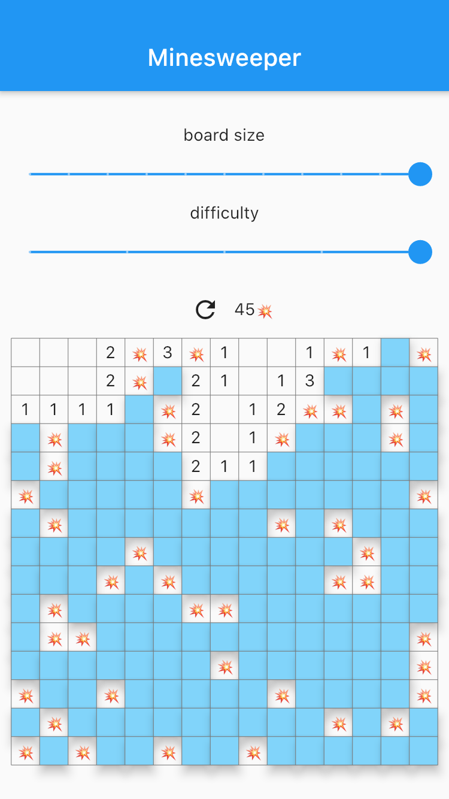

# minesweeper

Minesweeper game.

## Screenshots

    
    
    

## Features

* Responsive design - fits portrait, landscape, split-screen, tablet
* Tests
* Rive animations:
    * https://rive.app/community/files/11975-22809-kawaii-animals-crying/
    * https://rive.app/community/files/11976-22810-kawaii-animals-giving-love/

## Todo

* Performance #2
* Cell widget
* Improve code style
