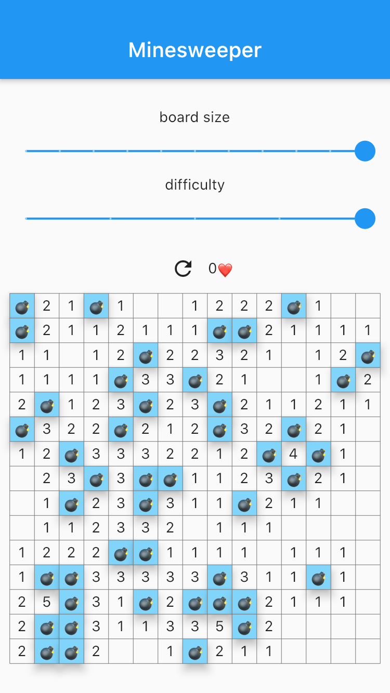

# minesweeper

Minesweeper game.

## Screenshots

    
    
    

## Features

* Responsive design - fits portrait, landscape, split-screen, tablet
* Tests
* Rive animations:
    * https://rive.app/a/bobagold/files/flare/winner-minesweeper/preview
    * https://rive.app/a/bobagold/files/flare/entrellas-minesweeper/preview

## Todo

* Art
* Save settings
* Performance #2
* Cell widget
* State management
